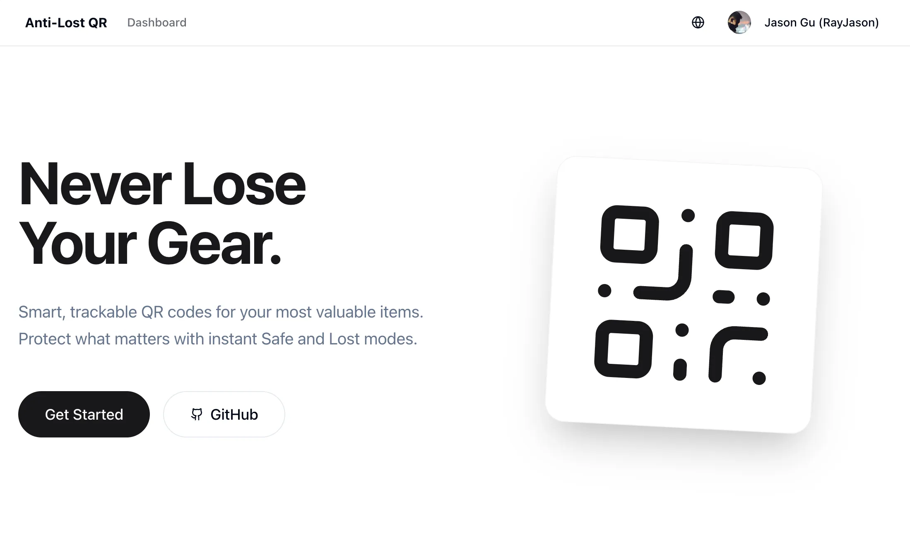
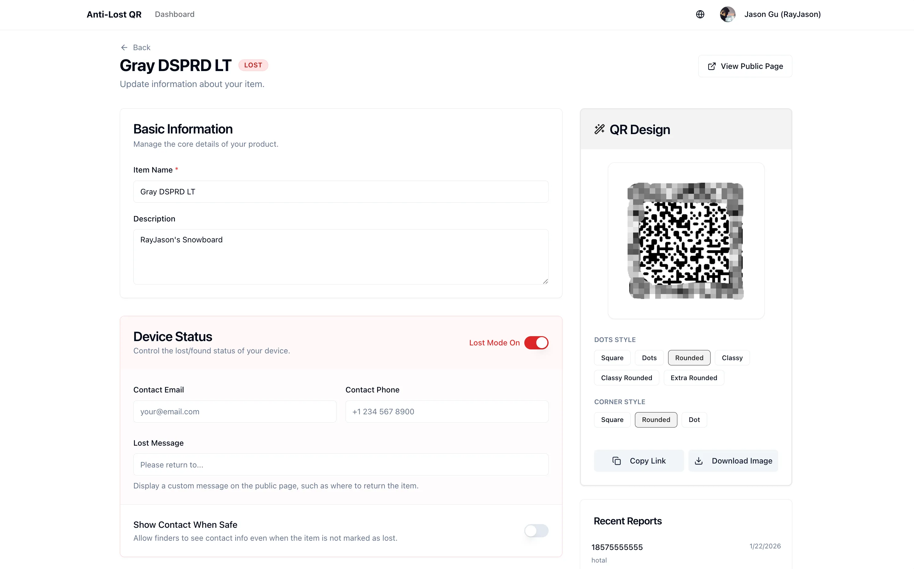
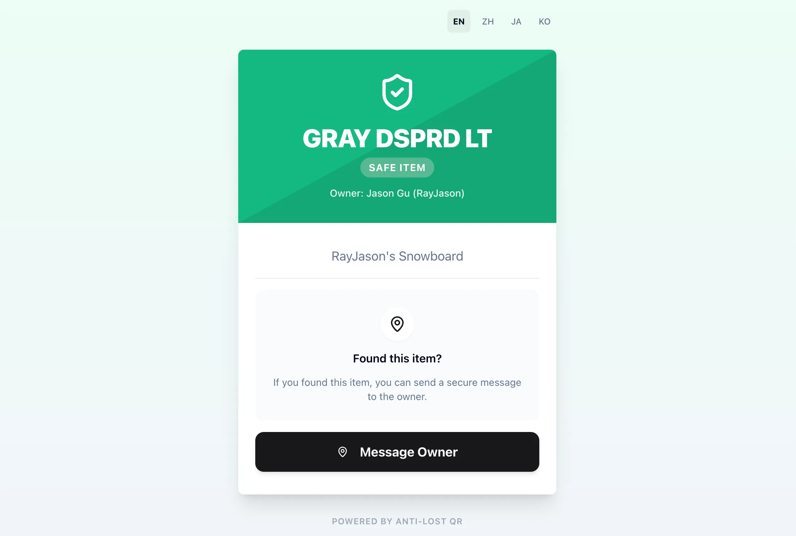
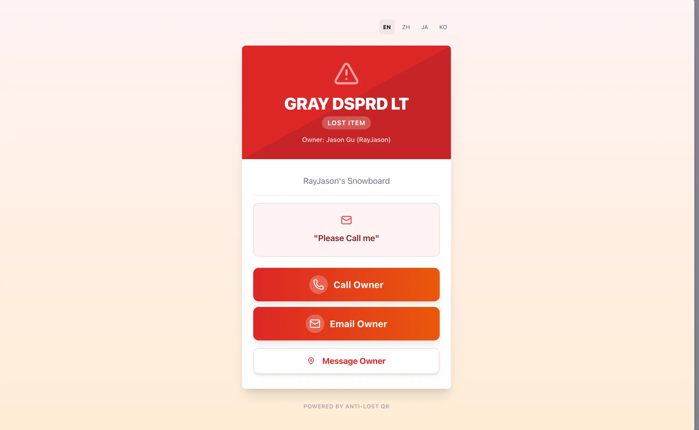

# Anti-Lost / Live QR

Anti-Lost is a Nuxt-based web application for creating dynamic QR pages for personal belongings. Instead of printing a static label with fixed contact details, the owner prints one QR code and keeps updating the destination page over time. When an item is safe, the page can stay minimal. When the item is lost, the same QR code can immediately switch into a recovery page with contact actions, a custom message, and a finder report form.

The project is designed for everyday items such as luggage, backpacks, keys, electronics, bikes, or work equipment. The core idea is simple: a printed QR code should not become outdated after the first day it is used.

## Background

Traditional lost-and-found tags have two common problems:

- They expose too much information all the time.
- They are static, so the printed label cannot adapt when the item status changes.

Anti-Lost addresses that by giving each item a permanent public URL at `/s/:id`. The owner manages the item from a private dashboard, while the person who scans the QR code sees a public page that reflects the latest state of the item.

## What The App Does

- Sign in with Google and create a personal dashboard.
- Register multiple items and assign each one a persistent public QR page.
- Generate styled QR codes and download them as images for printing.
- Switch an item between `NORMAL` and `LOST` status without changing the QR code URL.
- Show or hide owner contact details depending on the item state.
- Add a custom lost message for the public recovery page.
- Let finders submit a contact message through the public page.
- Store finder reports in the dashboard for later review.
- Send Feishu webhook notifications when a finder submits a report.
- Support multiple UI languages: English, Simplified Chinese, Japanese, and Korean.

## User Flow

1. The owner signs in with Google.
2. The owner creates an item from the dashboard.
3. The system generates a public page for that item at `/s/:id`.
4. The owner downloads and prints the QR code.
5. When someone scans the QR code:
   - In normal mode, the page can stay low-profile and optionally show contact details.
   - In lost mode, the page highlights that the item is lost, shows recovery actions, and allows the finder to send a message.
6. The owner receives the finder report in the dashboard and can optionally receive a Feishu notification.

## Screenshots

<p align="center">
  
</p>

<p align="center">
  
</p>

<p align="center">
  
</p>

<p align="center">
  
</p>

## Product Behavior

### Private Dashboard

- View all registered items.
- Open a detail page for each item.
- Edit item metadata such as name and description.
- Toggle between safe and lost states.
- Configure contact email, phone number, lost message, and Feishu webhook URL.
- Review recent finder reports.
- Delete items that are no longer needed.

### Public Item Page

- Accessible without authentication.
- Shows item name, description, and owner name.
- Only exposes a limited subset of fields.
- Supports direct contact actions such as phone and email when enabled.
- Includes a report form so a finder can leave contact information and a message.

## Privacy Model

This project intentionally separates private ownership data from public recovery data.

- The public API only exposes a restricted item payload.
- The owner's email is not exposed on the public page by default.
- Contact fields can be shown conditionally based on the item state.
- Session-protected dashboard routes are guarded by middleware and server-side session checks.

## Tech Stack

### Frontend

- Nuxt 4
- Vue 3
- TypeScript
- Tailwind CSS
- `@nuxtjs/i18n` for localization
- `vee-validate` + `zod` for form validation
- `vue-sonner` for toast notifications
- `lucide-vue-next` for icons

### UI / Interaction

- Reka UI primitives
- Local reusable UI components under `components/ui`
- `qr-code-styling` and `qrcode.vue` for QR generation and export
- `@vueuse/core` for clipboard and utility composables

### Backend

- Nuxt server routes under `server/api` and `server/routes`
- `nuxt-auth-utils` for session handling and OAuth helpers
- Google OAuth for authentication
- Prisma ORM for data access

### Deployment / Infrastructure

- The project is intended to be deployed and managed through Vercel
- Runtime environment variables are expected to be controlled from the Vercel project configuration
- Database credentials can be provisioned through Vercel-managed storage or environment settings, while the application itself consumes them through Prisma

### Database

- PostgreSQL as the primary database
- Prisma schema and migrations under `prisma/`
- The application connects to the database through Prisma using `DATABASE_URL`
- In production, the active database connection is expected to be managed from Vercel project settings
- The sample environment configuration is set up for Prisma Postgres, which is the third-party hosted PostgreSQL service shown in `.env.example`
- `.env.example` also includes `PRISMA_DATABASE_URL`, which indicates intended compatibility with Prisma Accelerate-style connection routing

### Notifications / Third-Party Services

- Google OAuth for login
- Feishu bot webhook for lost-item notifications
- Prisma Postgres as the external database service referenced by the project configuration

## Data Model

The main entities are:

- `User`: account profile, default contact info, and default Feishu webhook
- `Product`: the tracked item, including status, public contact fields, and recovery message
- `Report`: finder-submitted messages associated with an item
- `Account`, `Session`, and `VerificationToken`: authentication/session models used by the login flow

## Project Structure

```text
.
|-- pages/                      # Public pages and dashboard pages
|-- components/                 # Reusable Vue components
|-- server/api/                 # Authenticated and public API endpoints
|-- server/routes/              # OAuth route handlers
|-- prisma/                     # Prisma schema and SQL migrations
|-- i18n/translations/          # Localized strings
|-- assets/css/                 # Global styles
|-- public/                     # Static assets
```

## Environment Variables

Create a local `.env` file based on `.env.example`.

For deployed environments, manage the same variables in Vercel rather than committing secrets to the repository.

Required or commonly used variables:

- `DATABASE_URL`: PostgreSQL connection string. The example points to Prisma Postgres.
- `PRISMA_DATABASE_URL`: included in the sample env for Prisma Accelerate / data proxy style routing.
- `NUXT_SESSION_PASSWORD`: session secret used by `nuxt-auth-utils`.
- `NUXT_OAUTH_GOOGLE_CLIENT_ID`: Google OAuth client ID.
- `NUXT_OAUTH_GOOGLE_CLIENT_SECRET`: Google OAuth client secret.

Additional variable used by the notification flow:

- `AUTH_ORIGIN`: base URL used to build dashboard links inside Feishu notifications.

Note: `nuxt.config.ts` also reads `GOOGLE_CLIENT_ID` and `GOOGLE_CLIENT_SECRET` into runtime config. If you standardize the environment setup later, keep the README and config aligned.

## Open-Source Safety Checklist

Before publishing the repository, verify the following:

- Do not commit `.env`, `.env.local`, or any exported Vercel environment files.
- Do not commit production database URLs, Prisma API keys, OAuth client secrets, session secrets, or Feishu webhook URLs.
- Remove one-off debug scripts, sample IDs, or logs that reference live data.
- Rotate credentials if they were ever shared outside your own machine or a trusted Vercel project.
- Review Vercel project members and environment variables before making the repository public.
- Keep `.env.example` limited to placeholders only.

At the time of writing, the repository is structured correctly for open source as long as secrets remain outside version control and deployment credentials stay in Vercel project settings.

## Quick Private Deployment

The fastest way to self-host this project privately is to use Vercel as the control plane and keep the repository private.

1. Fork the repository or import it into your own private Git provider namespace.
2. Create a new Vercel project from that private repository.
3. Provision a PostgreSQL database through Vercel Storage or connect an external PostgreSQL instance.
4. Add the required environment variables in Vercel:
   - `DATABASE_URL`
   - `NUXT_SESSION_PASSWORD`
   - `NUXT_OAUTH_GOOGLE_CLIENT_ID`
   - `NUXT_OAUTH_GOOGLE_CLIENT_SECRET`
   - `AUTH_ORIGIN`
5. If you keep the current runtime config shape, also mirror the Google OAuth values into `GOOGLE_CLIENT_ID` and `GOOGLE_CLIENT_SECRET`, or remove that extra config path.
6. In Google Cloud Console, create your own OAuth app and set the authorized redirect URI to match your deployed `/auth/google` flow.
7. Optional: add a Feishu bot webhook if you want owner notifications for finder reports.
8. Deploy the app. The build script already runs `prisma generate`, `prisma migrate deploy`, and `nuxt build`.
9. After deployment, sign in once with your own Google account to bootstrap the first user record.

For local private deployment outside Vercel, the same environment variables still apply. The only mandatory infrastructure dependency is a PostgreSQL database reachable by Prisma.

## Local Development

Install dependencies:

```bash
bun install
```

You can also use `npm`, `pnpm`, or `yarn`, but the repository currently includes a `bun.lock` file.

Set up the database:

```bash
npx prisma migrate dev
```

Start the development server:

```bash
bun run dev
```

The app runs at `http://localhost:3000` by default.

## Production Build

Build the application:

```bash
bun run build
```

The current build script runs:

```bash
prisma generate && prisma migrate deploy && nuxt build
```

Preview the production build locally:

```bash
bun run preview
```

For production deployment, Vercel should be treated as the source of truth for environment configuration and connected storage resources.

## Key Routes

- `/`: marketing / landing page
- `/dashboard`: authenticated item list
- `/dashboard/products/:id`: item management page
- `/s/:id`: public recovery page for a QR code
- `/auth/google`: Google OAuth entry point

## Current Scope

This repository already covers the full core loop of a QR-based lost-and-found product:

- account login
- item creation and editing
- public recovery pages
- finder reporting
- notification hook integration

If you want to expand it, the most natural next steps are printable label templates, richer notification channels, better admin tooling, and analytics around scans and recovery events.
